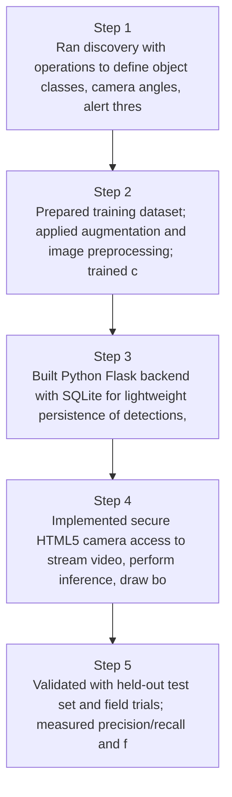
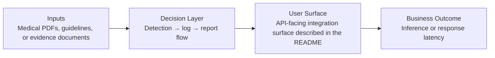
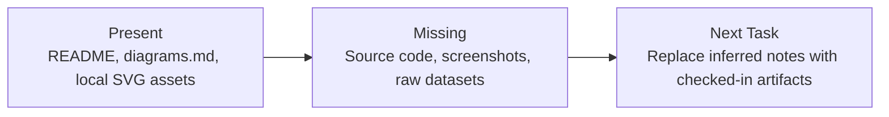

# Real-Time Web Object Detection Diagrams

Generated on 2026-04-26T04:29:37Z from README narrative plus project blueprint requirements.

## Browser inference pipeline

## Detection → log → report flow

## Evidence Gap Map

